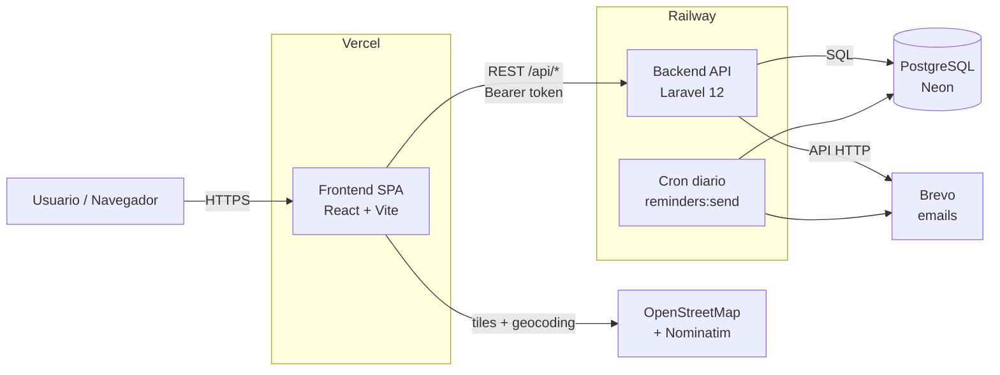
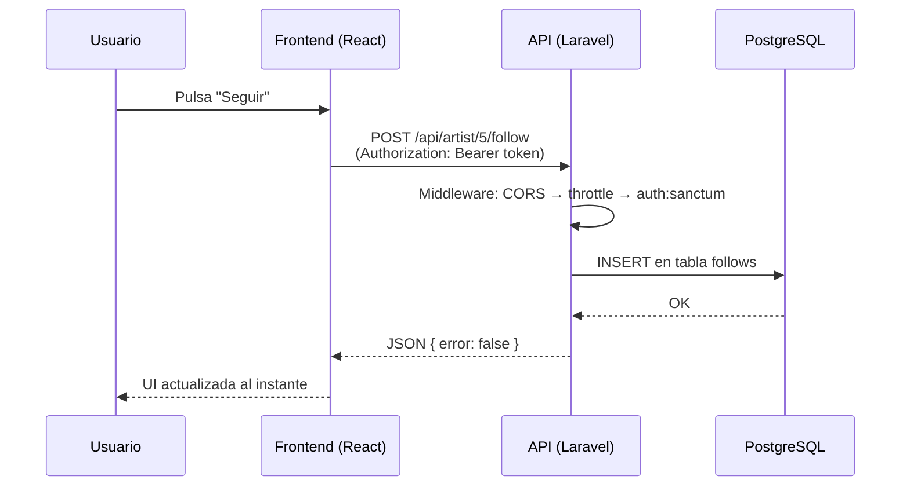

# Informe 0 — Visión general y arquitectura

> Este es el primer informe de la serie. Sirve de mapa: explica **qué es Libitum**, **con qué está hecho** y **cómo encajan todas las piezas**. Los demás informes entran en detalle en cada parte; conviene leer este primero.

---

## 1. ¿Qué es Libitum?

Libitum es una **plataforma para artistas de calle y música en vivo** que conecta a los artistas con su público. Un artista crea su perfil, publica sus eventos y comparte su página mediante un **QR**; el público descubre eventos, sigue a sus artistas favoritos, se apunta a eventos, recibe recordatorios y puede **apoyar económicamente** al artista (PayPal, Ko-fi, Bizum…).

Una idea clave de diseño: **Libitum no toca el dinero**. Las donaciones van directamente del donante al artista a través de plataformas externas. Eso nos quita toda la complejidad legal y técnica de ser una pasarela de pago.

---

## 2. Stack tecnológico

| Capa | Tecnología | Por qué |
|---|---|---|
| **Frontend** | React 19 + Vite | SPA rápida y moderna; Vite da un desarrollo ágil y un build optimizado. |
| **Estilos** | CSS Modules (SCSS) | Estilos encapsulados por componente, sin colisiones de nombres. |
| **Enrutado** | React Router 7 | Navegación SPA con carga diferida (lazy) por ruta. |
| **Mapas** | Leaflet + react-leaflet + OpenStreetMap/Nominatim | Mapas y autocompletado de direcciones **gratis y sin clave de API**. |
| **QR** | qrcode.react | Genera el QR del artista en el cliente. |
| **Backend** | Laravel 12 (API-only) | Framework PHP robusto; lo usamos solo como API REST. |
| **Autenticación** | Laravel Sanctum (tokens) | Tokens Bearer para una SPA en dominio distinto al backend. |
| **Roles/permisos** | spatie/laravel-permission | Gestiona los tres roles (espectador, artista, admin). |
| **Email** | Brevo (API HTTP) | Envío de correos por API (verificación, recordatorios) sin depender de SMTP. |
| **Base de datos** | PostgreSQL (Neon) | Relacional, fiable; Neon ofrece Postgres gestionado con capa gratis. |
| **Hosting back** | Railway | Despliega el backend Laravel y la base de datos de forma sencilla. |
| **Hosting front** | Vercel | CDN global para la SPA; despliegue automático desde Git. |

> Nota: `axios` aparece en las dependencias pero **no se usa**; toda la comunicación con la API va con `fetch` encapsulado en el hook `useAPI`.

---

## 3. Arquitectura general

Libitum es una **arquitectura desacoplada**: un frontend (SPA) y un backend (API REST) que viven en dominios distintos y se comunican por HTTP con JSON.



- El **frontend** (Vercel) sirve la web; es estático y escala "infinito" (CDN).
- El **backend** (Railway) expone la API en `/api/*` y es el único que habla con la base de datos.
- La **base de datos** (Neon) solo es accesible desde el backend.
- **Brevo** envía los correos (verificación de cuenta y recordatorios).
- **OpenStreetMap/Nominatim** los consulta el navegador directamente (mapas y búsqueda de direcciones).
- Un **cron diario** ejecuta el comando de recordatorios.

---

## 4. Cómo viaja una petición (ejemplo: seguir a un artista)



El patrón es siempre el mismo: el componente llama al hook **`useAPI`**, que añade el **token Bearer** y las cabeceras, hace `fetch`, y devuelve el JSON ya parseado (o lanza un error con mensaje en español). El backend valida, ejecuta la lógica y responde JSON.

---

## 5. Estructura del repositorio

El repositorio tiene dos proyectos independientes: `backend/` y `frontend/`.

### Backend (Laravel)

```
backend/
├── app/
│   ├── Console/Commands/   → comandos (batch de recordatorios)
│   ├── Http/
│   │   ├── Controllers/    → la lógica de la API por recurso
│   │   ├── Middleware/     → roles (admin, artista)
│   │   └── Requests/       → validación de formularios
│   ├── Mail/               → correos (recordatorio de evento)
│   ├── Models/             → Eloquent: User, Event, ArtistProfile, Category, Status
│   ├── Notifications/      → notificación de verificación de correo
│   └── Providers/          → arranque de servicios (transporte Brevo, https…)
├── config/                 → configuración (cors, mail, database…)
├── database/
│   ├── migrations/         → estructura de la base de datos
│   ├── seeders/            → datos iniciales (roles, estados, categorías…)
│   └── factories/          → generadores de datos para los tests
├── routes/
│   ├── api.php             → todas las rutas de la API
│   └── console.php         → programación del cron
└── tests/Feature/          → 37 tests automáticos
```

### Frontend (React)

```
frontend/src/
├── pages/        → una carpeta por "pantalla" (públicas y privadas)
├── components/   → piezas reutilizables (Event, MapView, PasswordInput…)
├── context/      → estado global (Auth, Eventos, Mensajes)
├── hooks/        → lógica reutilizable (useAPI, useAuthContext…)
├── routes/       → enrutado + guards (rutas protegidas por rol)
├── config/       → configuración (URL de la API, enlaces de mapas)
└── utils/        → utilidades (validaciones, geocoding…)
```

---

## 6. Decisiones de arquitectura clave (y por qué)

1. **Backend API-only + SPA separada.** El backend no pinta HTML, solo devuelve JSON. Esto permite que el frontend y el backend evolucionen por separado y se desplieguen en sitios distintos (Vercel y Railway).

2. **Autenticación por token (no por cookie).** Como el frontend (Vercel) y el backend (Railway) están en dominios diferentes, usar cookies de sesión sería problemático. Con **tokens Sanctum** guardados en el navegador y enviados como `Authorization: Bearer`, evitamos los líos de CORS con credenciales.

3. **Roles con Spatie.** Los tres tipos de usuario (espectador, artista, admin) se gestionan con permisos y middleware, en vez de con `if` repartidos por el código.

4. **Estado del evento automático.** En vez de que el artista marque "en directo" o "terminado" a mano, el estado se **calcula a partir de la fecha y la duración**. El artista solo elige borrador o publicado.

5. **No procesamos pagos.** Las donaciones van por plataformas externas. Mantiene el proyecto simple y sin responsabilidades legales de pasarela de pago.

6. **Mapas gratuitos (OpenStreetMap).** Migramos de Google Maps a OpenStreetMap para no depender de una tarjeta de crédito ni de una clave de API con posibles cobros.

---

## 7. Cifras del proyecto

| Métrica | Cantidad |
|---|---|
| Modelos de datos | 5 |
| Migraciones | 16 |
| Controladores de la API | ~22 |
| Páginas (frontend) | ~24 |
| Componentes reutilizables | ~43 |
| Tests automáticos | **37** (90 aserciones) |

---

## 8. Índice de la serie de informes

| Nº | Informe | Contenido |
|---|---|---|
| 0 | **Visión general y arquitectura** | *(este documento)* |
| 1 | Base de datos y modelo de datos | Tablas, relaciones, migraciones, seeders |
| 2 | Backend | Controladores, modelos, rutas, lógica |
| 3 | Seguridad y autenticación | Tokens, verificación, roles, rate-limit, CORS, RGPD |
| 4 | Frontend | Páginas, componentes, contextos, hooks |
| 5 | Configuración y librerías externas | Dependencias y configuración |
| 6 | Batch / tareas programadas | El comando de recordatorios y el cron |
| 7 | Tests | La batería de 37 tests |
| 8 | Despliegue | Railway, Vercel, Neon, Brevo |
| 9 | Problemas encontrados y soluciones | Bugs y decisiones técnicas |
| 10 | Decisiones de funcionalidad | Cambios de rumbo y cómo se aplicaron |
| 11 | Diseño y experiencia de usuario | Decisiones de UX y el porqué |
| 12 | Situación real y mejoras previstas | Estado actual y hoja de ruta |
| 13 | Monetización | Enfoque empresarial |
| 14 | Impacto en los artistas y pagos | Planteamiento de las donaciones |
```
