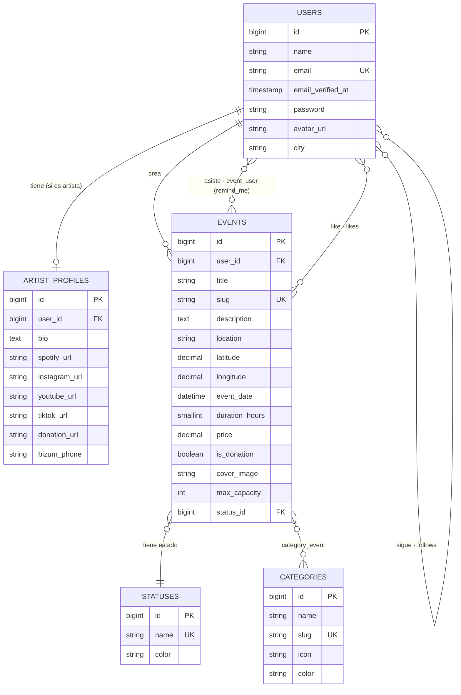
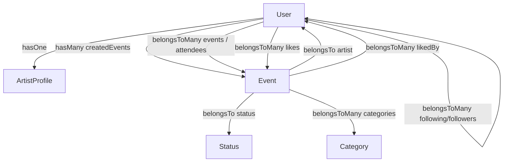

# Informe 1 — Base de datos y modelo de datos

> Este informe explica **cómo guardo la información**: qué tablas hay, cómo se relacionan, qué hace cada migración y qué datos iniciales meten los seeders. Es la base sobre la que se apoya todo el backend (Informe 2).

La base de datos es **PostgreSQL** (en producción, alojada en Neon). Todo el acceso se hace con el ORM **Eloquent** de Laravel: cada tabla importante tiene un modelo que la representa y define sus relaciones.

---

## 1. Diagrama entidad-relación

> Nota: las tablas intermedias (`category_event`, `event_user`, `follows`, `likes`) se dibujan como relaciones muchos-a-muchos; las detallo en la sección 3.

---

## 2. Tablas principales (entidades del dominio)

### `users` — usuarios
La tabla central. Un mismo usuario puede ser **espectador, artista o admin** (el rol lo gestiona Spatie, no una columna aquí).

| Columna | Tipo | Notas |
|---|---|---|
| `id` | bigint | Clave primaria |
| `name`, `surname`, `nickname` | string | Nombre (apellido y apodo opcionales) |
| `email` | string, **único** | Login |
| `email_verified_at` | timestamp, nullable | Si está a null, el usuario **no ha verificado** su correo |
| `phone_number`, `phone_number_verified` | string / bool | Teléfono opcional |
| `password` | string | Cifrada (hash) |
| `avatar_url`, `city` | string, nullable | Foto y ciudad |
| `last_connection` | timestamp | Última conexión |

### `artist_profiles` — perfil de artista (1 a 1 con users)
Datos extra que **solo tienen los artistas**. Se crea al registrarse como artista.

| Columna | Tipo | Notas |
|---|---|---|
| `user_id` | FK → users | A quién pertenece |
| `bio` | text | Biografía |
| `spotify_url`, `instagram_url`, `youtube_url`, `tiktok_url` | string | Redes |
| `donation_url` | string | Enlace de donación (Ko-fi, PayPal…) |
| `bizum_phone` | string | Móvil para Bizum (opcional) |

### `events` — eventos
Lo que crea un artista.

| Columna | Tipo | Notas |
|---|---|---|
| `user_id` | FK → users | El **artista** que lo crea |
| `title`, `slug`, `description` | string/text | `slug` único para URLs |
| `location`, `latitude`, `longitude` | string/decimal | Ubicación y coordenadas (para el mapa) |
| `event_date` | datetime | Cuándo es |
| `duration_hours` | smallint, nullable | Duración; sirve para calcular si está "en directo" o "terminado" |
| `price` | decimal | Precio de la entrada |
| `is_donation` | boolean | Si es de **donación voluntaria** (entrada gratis) |
| `cover_image` | string | Portada |
| `max_capacity` | int, nullable | Aforo máximo (opcional) |
| `status_id` | FK → statuses | Estado base (borrador / publicado) |

> **Atributos calculados (no son columnas):** el modelo Event añade en tiempo de ejecución `effective_status_name` (estado real calculado a partir de la fecha + duración: publicado → en directo → terminado), `signed_up` (si el usuario actual está apuntado) y `liked` (si le ha dado like). Se explican en el Informe 2.

### `categories` — categorías de evento
Catálogo fijo (Rock, Jazz, Pop, Clásica, Magia, Teatro, Danza, Circo, Otro). `name`, `slug` (único), `icon`, `color`.

### `statuses` — estados base del evento
Catálogo: `draft`, `published`, `live`, `finished`, `cancelled` (con un `color`).

---

## 3. Tablas intermedias (relaciones muchos-a-muchos)

Aquí está la "chicha" del modelo, las relaciones N:M:

| Tabla | Conecta | Datos extra | Para qué |
|---|---|---|---|
| `category_event` | events ↔ categories | — | Un evento tiene varias categorías y una categoría varios eventos |
| `event_user` | events ↔ users | **`remind_me`** (bool), timestamps | Asistencia: quién se apunta a qué evento. `remind_me` decide si recibe el recordatorio por email |
| `follows` | users ↔ users | timestamps | Seguimiento: `user_id` (quien sigue) → `artist_id` (a quién sigue) |
| `likes` | users ↔ events | timestamps | "Me gusta" / guardar evento |

> Detalle importante de `follows`: relaciona la tabla `users` **consigo misma** (un usuario sigue a otro usuario que es artista). Por eso el modelo User tiene dos relaciones: `following()` (a quién sigo) y `followers()` (quién me sigue), que son la misma tabla con las claves invertidas.

---

## 4. Relaciones en los modelos (Eloquent)

Cada relación de la base de datos se traduce a un método en el modelo:

| Modelo | Relación | Tipo | Significado |
|---|---|---|---|
| **User** | `artistProfile` | hasOne | Su perfil de artista (si lo es) |
| | `createdEvents` | hasMany | Eventos que ha creado |
| | `events` / `attendees` | belongsToMany (`event_user`) | Eventos a los que asiste |
| | `likes` | belongsToMany (`likes`) | Eventos que le gustan |
| | `following` | belongsToMany (`follows`) | Artistas a los que sigue |
| | `followers` | belongsToMany (`follows`) | Quién le sigue |
| **Event** | `artist` | belongsTo | El artista creador |
| | `status` | belongsTo | Estado base |
| | `categories` | belongsToMany | Sus categorías |
| | `attendees` | belongsToMany | Quién va |
| | `likedBy` | belongsToMany | Quién le ha dado like |
| **ArtistProfile** | `user` | belongsTo | Su dueño |
| **Category / Status** | `events` | belongsToMany / hasMany | Eventos de esa categoría/estado |

---

## 5. Migraciones

Las migraciones son el **historial versionado de la estructura** de la base de datos: cada una crea o modifica tablas. Al desplegar se ejecutan con `php artisan migrate` (y en producción el Procfile lo hace solo).

| Migración | Qué hace |
|---|---|
| `create_users_table` | Tabla de usuarios |
| `create_statuses_table` | Estados de evento |
| `create_categories_table` | Categorías |
| `create_events_table` | Eventos (con FK a users y statuses) |
| `create_category_event_table` | Pivote eventos↔categorías |
| `create_event_user_table` | Pivote asistencia (con `remind_me`) |
| `create_artist_profiles_table` | Perfil de artista |
| `create_follows_table` | Seguimientos |
| `create_likes_table` | Me gusta |
| `create_personal_access_tokens_table` | Tokens de Sanctum (login) |
| `create_permission_tables` | Tablas de Spatie (roles y permisos) |
| `add_duration_hours_to_events_table` | Añade la duración del evento |
| `add_bizum_phone_to_artist_profiles_table` | Añade el Bizum del artista |
| `add_is_donation_to_events_table` | Añade la donación voluntaria |
| `create_cache_table`, `create_jobs_table` | Tablas internas de Laravel (caché y colas) |

> Las tres últimas migraciones con prefijo `2026_05_29` son ampliaciones recientes (duración, Bizum y donación voluntaria): se ven en el historial como mejoras añadidas sin romper lo anterior.

---

## 6. Tablas de infraestructura (no son del dominio)

Además de las tablas "de negocio", hay tablas que aporta el framework:

- **`personal_access_tokens`** (Sanctum): guarda los tokens de sesión. Cuando un usuario hace login, aquí se crea su token Bearer.
- **`password_reset_tokens`**: guarda el token temporal del flujo "olvidé mi contraseña" (ver Informe 3).
- **`roles`, `permissions`, `model_has_roles`, `role_has_permissions`…** (Spatie): gestionan los tres roles (admin, artist, spectator) y sus permisos.
- **`cache`, `jobs`**: caché y cola de trabajos internas de Laravel.

---

## 7. Seeders (datos iniciales)

Los seeders rellenan la base de datos con los datos que la app **necesita para funcionar**:

| Seeder | Qué inserta |
|---|---|
| `StatusSeeder` | Los 5 estados: draft, published, live, finished, cancelled |
| `PermissionSeeder` | Los permisos del sistema |
| `RoleSeeder` | Los 3 roles (admin, artist, spectator) y sus permisos |
| `DatabaseSeeder` | **Solo para desarrollo**: datos de prueba (artistas, eventos y espectadores falsos) |
| `ProductionSeeder` | **Para producción**: solo lo imprescindible (estados, roles, categorías reales y un usuario admin). Sin datos falsos. Es idempotente (se puede ejecutar varias veces sin duplicar) |

> La separación entre `DatabaseSeeder` (desarrollo, con datos de relleno) y `ProductionSeeder` (producción, limpio) es a propósito: la web real arranca **vacía de contenido** pero con todo lo necesario para que la gente empiece a usarla.

---

## 8. Resumen

- **5 entidades de dominio**: users, artist_profiles, events, categories, statuses.
- **4 tablas intermedias** que modelan las relaciones N:M (asistencia, seguimiento, likes, categorías).
- La asistencia (`event_user`) lleva el campo **`remind_me`**, que es lo que conecta esta base de datos con el **batch de recordatorios** (Informe 6).
- Todo el acceso pasa por **Eloquent**: nunca escribo SQL a mano salvo casos puntuales y justificados (Informe 9).

> Siguiente: **Informe 2 — Backend**, donde explico cómo los controladores usan estos modelos para responder a la API.
