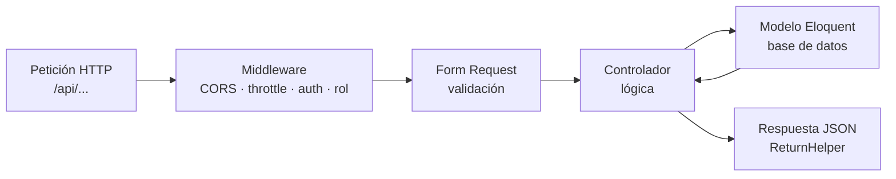
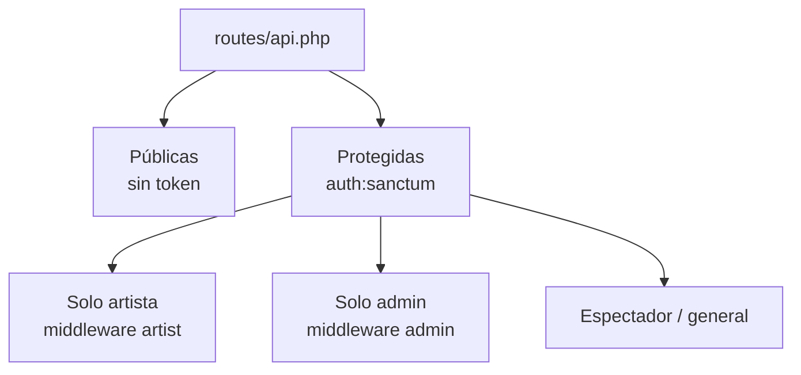
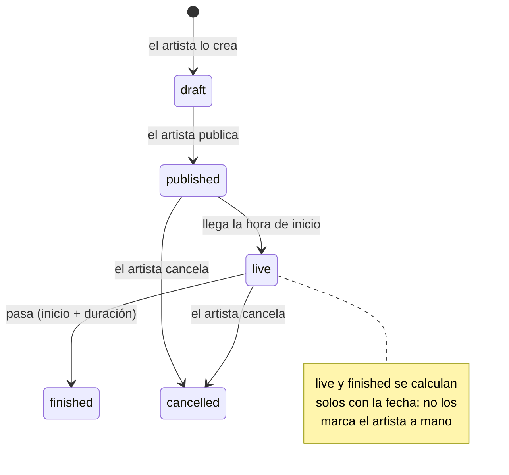

# Informe 2 — Backend

> Este informe explica el **cerebro de la aplicación**: cómo Laravel recibe una petición de la API, la valida, ejecuta la lógica con los modelos del Informe 1 y devuelve una respuesta JSON. Aquí están los controladores, las rutas, los middleware, la validación y la lógica de negocio más importante.

El backend es **Laravel 12 funcionando como API**: no genera HTML, solo responde **JSON** que consume el frontend (Informe 4).

---

## 1. Ciclo de vida de una petición

Toda petición a la API pasa por la misma cadena:

1. **Middleware**: filtros que se ejecutan antes del controlador (¿hay token? ¿tiene el rol? ¿no ha hecho demasiadas peticiones?).
2. **Form Request**: valida los datos de entrada antes de llegar al controlador.
3. **Controlador**: ejecuta la lógica usando los modelos.
4. **Modelo (Eloquent)**: habla con la base de datos.
5. **Respuesta**: JSON con un formato consistente.

---

## 2. Las rutas (`routes/api.php`)

Las rutas están organizadas por **nivel de acceso**:

- **Públicas**: login, registro, verificación de correo, ver eventos/artistas/usuarios, buscar eventos, catálogos (categorías, estados). Llevan rate-limit donde hace falta (login/registro).
- **Protegidas** (`auth:sanctum`): todo lo que requiere estar logueado.
  - **Artista** (`middleware('artist')`): CRUD de sus eventos, sus estadísticas, su perfil de artista.
  - **Admin** (`middleware('admin')`): gestión de usuarios y eventos.
  - **Espectador/general**: inscribirse a eventos, favoritos, feed, seguir artistas, likes, editar perfil.

---

## 3. Controladores

Cada controlador agrupa la lógica de un recurso. Estos son los que **usa la API** de verdad:

| Controlador | Responsabilidad | Métodos clave |
|---|---|---|
| **Api\AuthController** | Autenticación | `register`, `verify` (login), `logout` |
| **Api\EmailVerificationController** | Verificación de correo | `verify` (enlace del email), `resend` |
| **Api\PasswordResetController** | Recuperar contraseña | `forgot` (envía enlace), `reset` (cambia con token) |
| **EventController** | Todo lo de eventos | `index`, `show`, `store`, `update`, `destroy`, `search`, `inscription`, `signedUp`, `remindMe`, `destroySignedUp`, `categories`, `status`, `uploadCover`, `favorites`, `allEventsForAdmin`, `destroyByAdmin` |
| **FeedController** | El feed "Para Ti" | `index` |
| **ArtistProfileController** | Perfil público de artista | `index` (listado), `show`, `update`, `statistics` |
| **UserProfileController** | Perfil social de usuario | `show`, `followers`, `following` |
| **ProfileController** | Cuenta del usuario logueado | `update`, `uploadAvatar`, `changePassword`, `destroy` |
| **FollowerController** | Seguir/dejar de seguir | `store`, `destroy`, `index`, `followers` |
| **LikeController** | Me gusta | `toggle` |
| **CategoryController / StatusController** | Catálogos | `index` |
| **AdminUserController** | Panel admin (usuarios) | `index`, `show`, `update`, `destroy` |

> **Nota honesta:** la carpeta `app/Http/Controllers/Auth/` contiene los controladores **de scaffolding de Laravel Breeze** (login/registro web, reset de contraseña…). **El SPA no los usa**: la autenticación real va por `Api\AuthController` y `Api\EmailVerificationController`. Quedan ahí como restos de la plantilla inicial.

### El controlador estrella: `EventController`
Es el más grande porque concentra el núcleo del negocio. Algunos métodos destacados:
- `store` / `update`: crean/editan un evento. Aquí está la lógica de **donación voluntaria** (si `is_donation`, el precio se fuerza a 0).
- `show`: devuelve un evento; como es ruta pública, resuelve al usuario por su token **si lo trae** para indicar si ya está apuntado (`signed_up`) o le ha dado like.
- `inscription` / `destroySignedUp`: apuntarse / darse de baja, validando el **aforo máximo**.
- `remindMe`: activa/desactiva el recordatorio por email (campo `remind_me` de la tabla `event_user`).
- `search`: búsqueda pública con filtros (texto, categoría, estado) y paginación.

---

## 4. Middleware (los "filtros")

| Middleware | Qué comprueba |
|---|---|
| `auth:sanctum` | Que la petición traiga un **token válido** |
| `admin` (AdminMiddleware) | Que el usuario tenga rol **admin**; si no → 403 |
| `artist` (IsArtist) | Que tenga rol **artista** y un perfil de artista; si no → 403 |
| `throttle:6,1` | Máximo 6 intentos/minuto (login, registro, reenvío de correo) |

Ejemplo real (AdminMiddleware): si el usuario no está autenticado o no es admin, devuelve directamente un **403** sin llegar al controlador.

---

## 5. Validación: los Form Requests

En vez de validar dentro del controlador, Laravel usa **clases Request** que validan **antes** de entrar:

| Request | Valida |
|---|---|
| `StoreEventRequest` / `UpdateEventRequest` | Crear/editar evento (título, fecha, precio, `is_donation`, aforo, duración…) |
| `CategoriesRequest` | Las categorías de un evento |
| `StatusEventRequest` | El cambio de estado |
| `RemindMeRequest` | El flag de recordatorio |
| `ProfileUpdateRequest` | Datos del perfil |

Si la validación falla, Laravel devuelve un **422** con los errores **en español** (ver Informe 3 sobre las traducciones), sin que el controlador llegue a ejecutarse.

---

## 6. Lógica de negocio destacada: el estado automático del evento

La parte más "inteligente" del backend está en el **modelo Event**. El artista solo decide entre **borrador** y **publicado**; el resto (en directo, terminado) **se calcula solo** a partir de la fecha y la duración.

El cálculo (`getEffectiveStatusNameAttribute`):
- **draft** y **cancelled** no se tocan nunca (son decisiones manuales).
- Para el resto, con la fecha de inicio y la duración (2h por defecto):
  - si ya pasó el final (inicio + duración) → **finished**
  - si estamos entre el inicio y el final → **live**
  - si aún no ha empezado → **published**

Este estado calculado se expone como `effective_status_name` (un atributo "appended": viaja en el JSON aunque no sea una columna). Así el frontend siempre muestra el estado real sin que nadie tenga que actualizarlo a mano.

---

## 7. Respuestas consistentes: `ReturnHelper`

Para que **toda la API responda igual**, uso un helper (`App\Util\ReturnHelper`) con métodos como:
- `ReturnHelper::ok($mensaje, $datos)` → respuesta de éxito.
- `ReturnHelper::error($mensaje, $status)` → respuesta de error.

Así el frontend siempre recibe la misma estructura (`error`, `message`, `data`…) y puede tratarla de forma uniforme.

---

## 8. Resumen

- El backend es una **API REST** en Laravel 12: recibe JSON, valida, ejecuta y responde JSON.
- Las rutas se organizan por **acceso** (público / logueado / artista / admin) con middleware.
- La validación vive en **Form Requests** separados, con mensajes en español.
- La lógica más característica es el **estado automático del evento**, calculado en el modelo a partir de la fecha.
- Toda la autenticación de verdad pasa por los controladores de `Api/` (los de `Auth/` son scaffolding sin usar).

> Siguiente: **Informe 3 — Seguridad y autenticación**, donde explico a fondo los tokens, la verificación de correo, los roles y las protecciones (rate-limit, CORS, RGPD).
