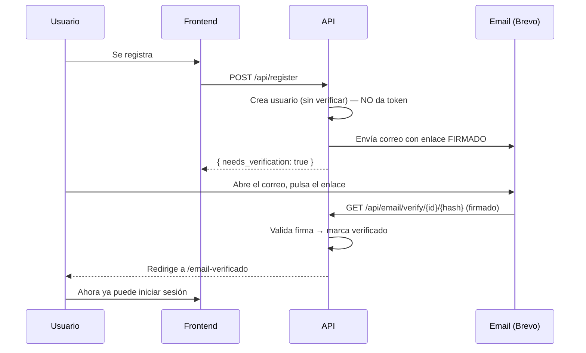
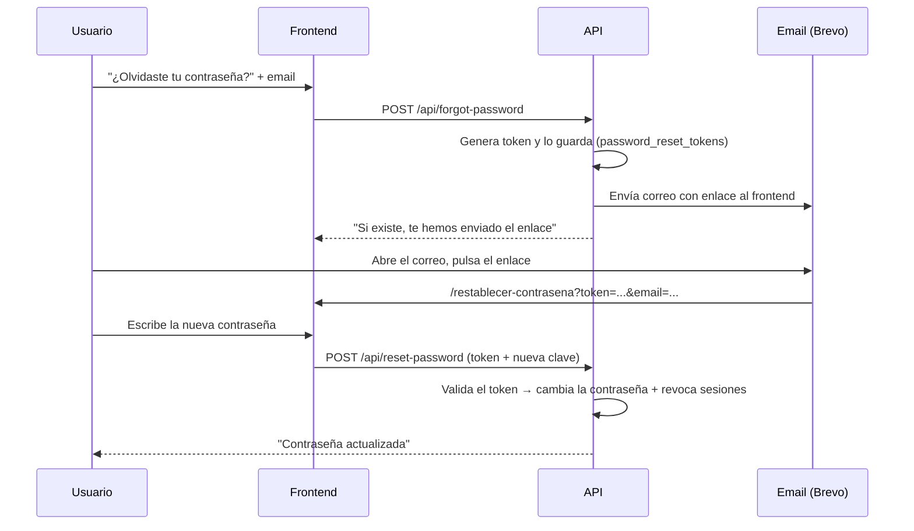
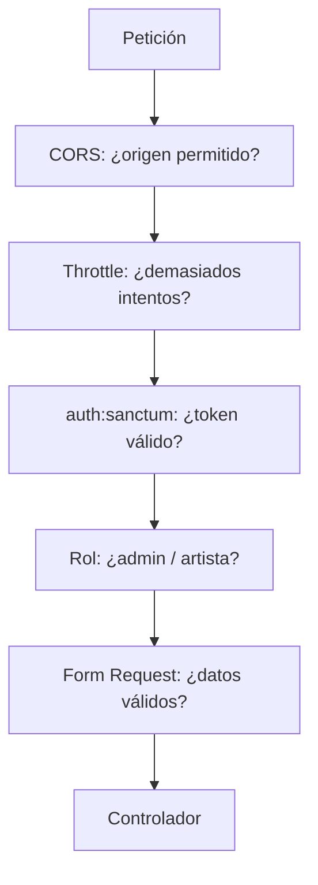

# Informe 3 — Seguridad y autenticación

> Este informe explica **cómo protejo la aplicación y a sus usuarios**: cómo funciona el login, la verificación de correo, los roles, y todas las medidas de seguridad (límite de intentos, CORS, contraseñas, RGPD…). Es la parte que demuestra que el proyecto está pensado para usarse con datos reales.

---

## 1. Autenticación por token (Laravel Sanctum)

Como el frontend (Vercel) y el backend (Railway) están en **dominios distintos**, no uso cookies de sesión, sino **tokens**:

- Al iniciar sesión, el backend genera un **token Sanctum** y lo devuelve.
- El frontend lo guarda en `localStorage` y lo envía en **cada petición** como cabecera `Authorization: Bearer <token>`.
- Las rutas protegidas usan el middleware `auth:sanctum`, que comprueba que el token sea válido.
- Al cerrar sesión, el token se **elimina** de la base de datos (`tokens()->delete()`), invalidándolo.

> Decisión: token en vez de cookie evita problemas de CORS con credenciales entre dominios distintos.

---

## 2. Verificación de correo obligatoria

El modelo `User` implementa `MustVerifyEmail`. El flujo completo:

Puntos de seguridad clave:
- **Al registrarse NO se entrega token**: hay que confirmar el correo primero.
- **Al hacer login**, si el correo no está verificado, el backend responde **403** y no da token.
- El enlace del correo es una **URL firmada y temporal** (`temporarySignedRoute`, caduca a los 60 min). El middleware `signed` valida que nadie la haya manipulado.
- El reenvío de verificación (`/api/email/resend`) lleva **throttle** para que no se pueda abusar.

> Detalle de producción: como Railway sirve detrás de un proxy, fuerzo HTTPS al generar URLs (`URL::forceScheme('https')`) y confío en el proxy (`trustProxies`), porque si no la firma del enlace no validaría (http vs https).

---

## 3. Recuperar contraseña por correo ("olvidé mi contraseña")

Si un usuario no recuerda su contraseña, puede pedir un enlace para crear una nueva, **sin necesidad de saber la antigua**. La seguridad la da un **token secreto** que solo llega a su correo.

Puntos de seguridad:
- Uso el **"Password Broker" de Laravel**, que genera y valida el token contra la tabla `password_reset_tokens`, con **caducidad**.
- Al pedir el enlace, respondo **siempre igual** aunque el correo no exista → no revelo qué correos están registrados.
- El enlace del correo apunta al **frontend** (no al backend), porque la app es un SPA.
- Al cambiar la contraseña, **revoco todas las sesiones anteriores** (`tokens()->delete()`) por seguridad.
- Ambos endpoints (`/forgot-password`, `/reset-password`) llevan **throttle** y la nueva contraseña exige **mínimo 8 caracteres**.

> Diferencia con el "cambiar contraseña" del perfil: aquel **sí** pide la contraseña actual (el usuario la sabe); este **no**, porque precisamente la ha olvidado — por eso la seguridad recae en el token del enlace.

---

## 4. Roles y permisos (Spatie)

Tres roles, gestionados con `spatie/laravel-permission`:

| Rol | Puede |
|---|---|
| **spectator** | Ver, seguir artistas, apuntarse a eventos, likes |
| **artist** | Todo lo anterior + crear/gestionar sus eventos, estadísticas, perfil de artista |
| **admin** | Gestionar usuarios y eventos |

La protección se hace con **middleware** en las rutas:
- `middleware('admin')` → solo admin (si no, 403).
- `middleware('artist')` → solo artista con perfil (si no, 403).

Además, el rol se asigna de forma **segura en el registro**: aunque alguien manipule la petición, solo puede elegir entre `artist` o `spectator` (nunca `admin`).

---

## 5. Protección contra ataques

| Medida | Cómo | Para qué |
|---|---|---|
| **Rate-limit** | `throttle:6,1` en login, registro y reenvío | Máx. 6 intentos/minuto por IP → frena la **fuerza bruta** |
| **CORS restringido** | Solo `FRONTEND_URL`, localhost y previews de Vercel | Evita que otras webs usen la API |
| **Contraseñas cifradas** | Cast `hashed` (bcrypt) | Nunca se guardan en texto plano |
| **Contraseña mínima 8** | Validación back y front | Contraseñas más fuertes |
| **APP_DEBUG=false** en producción | Variable de entorno | No filtra detalles internos en los errores |
| **Validación de entrada** | Form Requests | Evita datos maliciosos o malformados |
| **Secretos fuera del repo** | Variables de entorno | Tokens y claves nunca se suben a Git |

---

## 6. Protección específica del dominio

Dos medidas pensadas para **proteger a los usuarios entre sí**:

- **Enlaces de donación de confianza:** cuando un artista pone su enlace de donación, se valida contra una **lista blanca de dominios** (Ko-fi, PayPal, Buy Me a Coffee, Patreon, GoFundMe, Stripe, Twitch…). Así un artista no puede colar un enlace fraudulento a sus seguidores.
- **Bizum bajo consentimiento:** el número de Bizum lo publica el artista voluntariamente y se le avisa de que será visible. Se valida que sea un móvil español real.

---

## 7. Privacidad y RGPD

Al usarse con datos personales reales (en España), incluyo:

- **Política de privacidad** (`/privacidad`) y **Términos de uso** (`/terminos`): explican qué datos recojo, para qué, con quién se comparten y los derechos del usuario.
- **Derecho al borrado:** el usuario puede **eliminar su cuenta** desde la **"zona de peligro"** de su propio perfil. Por seguridad se le pide **confirmar la contraseña** antes de borrar (validación `current_password`), y el endpoint (`ProfileController@destroy`) elimina sus datos y **revoca todos sus tokens**.
- **No se procesan pagos:** las donaciones van por plataformas externas, así que **no guardo ningún dato bancario** → menos responsabilidad legal.
- **Sin cookies de seguimiento:** solo uso `localStorage` para el token de sesión (fin técnico), no rastreo.

---

## 8. Resumen de la "capa de seguridad"

Cada petición sensible atraviesa varias capas antes de ejecutarse: origen permitido → no abusar → autenticado → con el rol correcto → con datos válidos.

- **Autenticación:** tokens Sanctum + verificación de correo obligatoria.
- **Autorización:** tres roles con Spatie y middleware.
- **Defensa:** rate-limit, CORS, contraseñas fuertes y cifradas, validación.
- **Cumplimiento:** privacidad, términos y borrado de cuenta (RGPD).

> Siguiente: **Informe 4 — Frontend**, donde explico cómo el cliente React consume esta API de forma segura (token, guards de ruta, manejo de errores).
