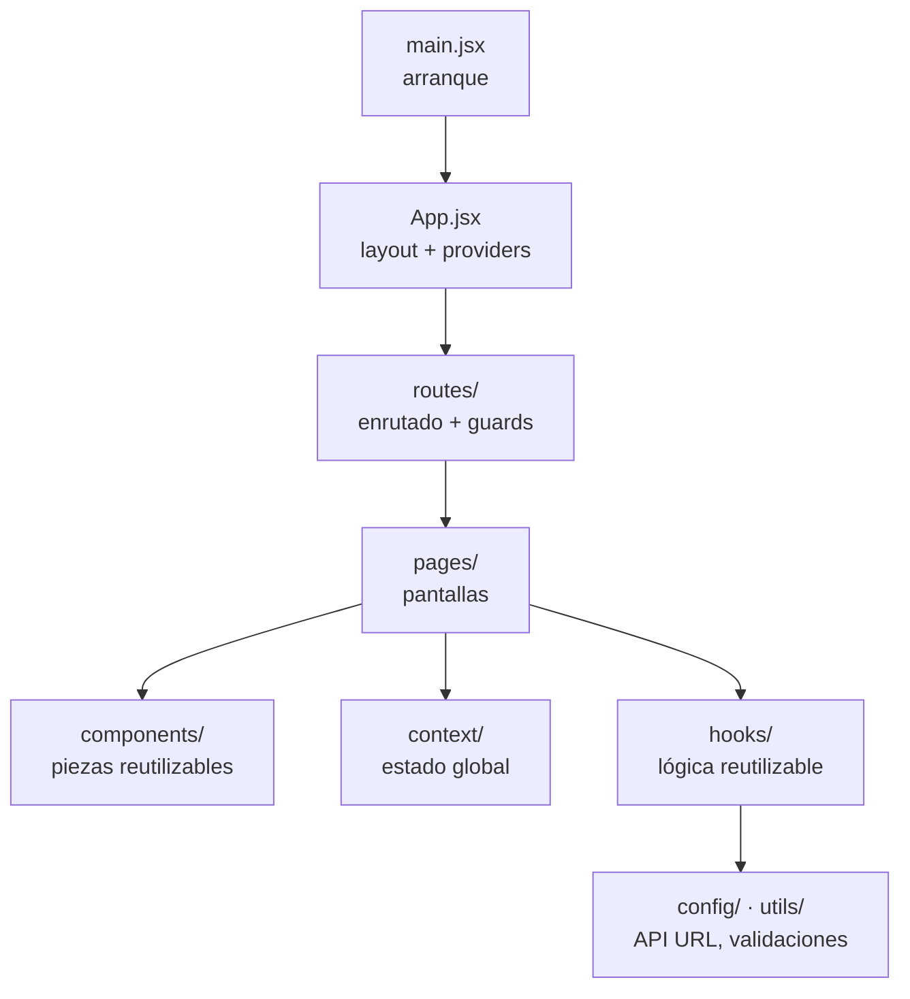
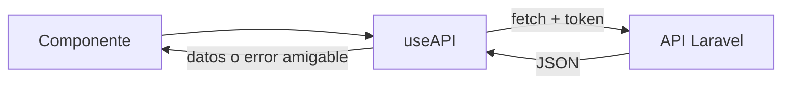
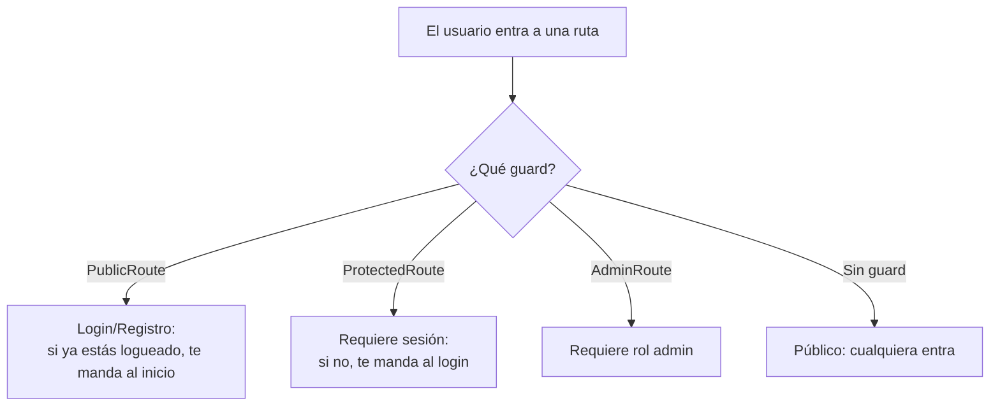
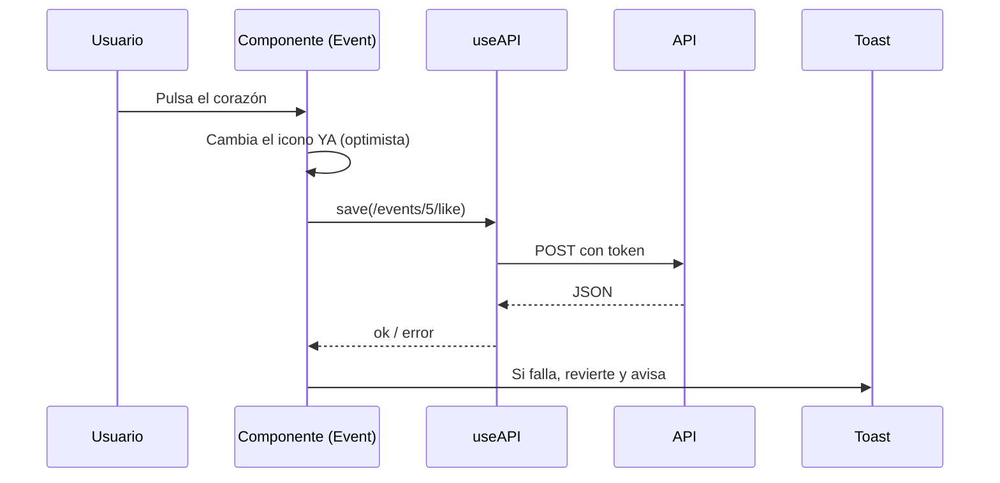

# Informe 4 — Frontend

> Este informe explica el **lado del cliente**: la aplicación React que ve el usuario. Cómo está organizada, cómo habla con la API del backend (Informe 2), cómo gestiona el estado y cómo protege las rutas según el rol.

El frontend es una **SPA (Single Page Application)** hecha con **React 19 + Vite**. Se despliega en Vercel y consume la API de Laravel por HTTP.

---

## 1. Cómo está organizado (capas)

Todo vive en `frontend/src/`, separado por responsabilidad:

| Carpeta | Qué contiene |
|---|---|
| `pages/` | Una "pantalla" por archivo (públicas y privadas) |
| `components/` | Piezas reutilizables (tarjeta de evento, mapa, botones…) |
| `context/` | Estado global compartido (sesión, eventos, mensajes) |
| `hooks/` | Lógica reutilizable (llamadas a la API, acceso a los contextos) |
| `routes/` | El enrutado y los "guards" que protegen rutas por rol |
| `config/` | Configuración (URL base de la API, enlaces de mapas) |
| `utils/` | Utilidades (validaciones de formularios, geocoding) |

---

## 2. La capa de comunicación con la API: `useAPI`

Toda la comunicación con el backend pasa por **un único hook**, `useAPI`. Así no repito la misma lógica en cada componente:

- Envuelve `fetch` y añade automáticamente el **token Bearer** (sacado de `localStorage`) y las cabeceras.
- Expone helpers por verbo: `getData`, `save` (POST), `edit` (PUT), `patch`, `deleteData`, `uploadFile`.
- **Traduce los errores a español amigable**: si el backend devuelve 500, 404, etc. o falla la red, el usuario ve un mensaje claro en vez de algo técnico.

> Detalle de seguridad: el geocoding (buscar direcciones) NO usa `useAPI`, sino un `fetch` "pelado", **a propósito**, para no enviar nuestro token de sesión a un servicio externo (OpenStreetMap).

---

## 3. Estado global: los tres contextos

Para compartir datos entre muchos componentes sin pasarlos "a mano", uso **React Context**. Tengo tres:

| Contexto | Qué guarda / hace | Hook para usarlo |
|---|---|---|
| **AuthProvider** | El usuario logueado, el token, y las acciones de sesión (login, logout, registro, recuperar verificación). Valida la sesión al arrancar | `useAuthContext` |
| **EventProvider** | Los eventos del artista, el formulario de crear/editar, y los catálogos (categorías, estados) | `useEventContext` |
| **MessageProvider** | El "toast" global (mensajes de éxito/error que aparecen arriba) | `useMessageContext` |

Estos providers envuelven la app en `main.jsx`/`App.jsx`, así que cualquier componente puede acceder a la sesión, lanzar un mensaje, etc.

---

## 4. Enrutado y protección por rol (guards)

El enrutado usa **React Router 7** con **carga diferida** (cada página se descarga solo al visitarla, ver Informe 9 sobre rendimiento). Las rutas se protegen con **guards**:

- **PublicRoute**: para login/registro/recuperar contraseña. Si ya tienes sesión, te redirige (no tiene sentido ver el login logueado).
- **ProtectedRoute**: para lo que requiere sesión (feed, favoritos, mis eventos…). Si no hay sesión, al login.
- **AdminRoute**: solo el admin entra al panel.

> La seguridad **real** está en el backend (Informe 3); estos guards son la capa de **experiencia de usuario** (que no veas pantallas que no te corresponden).

---

## 5. Las páginas (`pages/`)

Separadas en **públicas** y **privadas**:

**Públicas** (cualquiera, sin sesión):
- `Landing` / `Home` (vía `RootPage`: invitado ve Landing, logueado ve Home)
- `Login`, `Register`, `ForgotPassword`, `ResetPassword`, `EmailVerified`
- `ArtistProfile` (la página del QR del artista), `Artists` (explorar), `UserProfile`, `EventDetail`, `SearchEvents`
- `About`, `Contact`, `PaymentsInfo`, `PrivacyPolicy`, `Terms`, `Error`

**Privadas** (requieren sesión / rol):
- `Feed` ("Para Ti"), `Favorites`, `MyAttendance` (espectador/artista)
- `PageEvents` (Mis Eventos), `ArtistQR`, `ArtistStats` (artista)
- `AdminDashboard` (admin)

---

## 6. Componentes reutilizables (`components/`)

Organizados por temática:

| Carpeta | Componentes destacados |
|---|---|
| **common** | `Event`/`MiniEvent` (tarjetas), `MapView` (mapa Leaflet), `PasswordInput` (con ojo), `ShareButton`, `FitText` (título que encoge), `ConfirmModal`, `Loading`/`Loader`/`LoadingDots`, `MessageApp` (toast), `ErrorBoundary`, `EmptyState`, `EventStatusBadge` |
| **layout** | `Header`, `Footer`, `Container`, `Content` (la estructura común) |
| **profile** | `ProfileHeader`, `ProfileForms`, `PasswordForm`, `ArtistEditForm`, `ArtistHero`, `BizumCard`… |
| **admin** | `AdminTable`, `UserRow`, `EventRow`, `AdminActionButton` |
| **auth** | `VerifyNotice` (aviso de "verifica tu correo") |

Cada componente tiene su propio `.module.scss` (estilos encapsulados que no chocan con otros).

---

## 7. Flujo típico (ejemplo: dar "me gusta")

Patrón habitual: **actualización optimista** (la interfaz cambia al instante para que se sienta rápida) y, si el backend falla, se revierte y se muestra un mensaje.

---

## 8. Estilos y diseño

- **CSS Modules con SCSS**: cada componente tiene su `.module.scss`; las clases se "hashean" para no colisionar.
- **Design tokens**: en `index.scss` defino variables CSS (`--color-primary`, `--font-display`, fondo crema…). Todos los componentes las usan, así que cambiar la paleta es tocar un sitio. (Más en el Informe 11 sobre diseño.)

---

## 9. Robustez de la interfaz

- **ErrorBoundary**: si algo revienta (p.ej. falla la descarga de un trozo de código), en vez de pantalla en blanco sale un aviso con botón de recargar (y recarga sola en fallos de carga).
- **Estados de carga**: componentes `Loading`/`Loader`/skeletons mientras llegan los datos.
- **Mensajes (toasts)**: feedback claro de éxito/error, con animación y barra de progreso.

---

## 10. Resumen

- SPA en **React 19 + Vite**, desplegada en Vercel.
- Toda la comunicación con el backend pasa por **un hook (`useAPI`)** con token y errores amigables.
- El estado global vive en **tres contextos** (sesión, eventos, mensajes).
- Las rutas se cargan **bajo demanda** y se protegen con **guards** según el rol.
- Estilos **encapsulados** (CSS Modules) sobre un sistema de **tokens** de diseño.

> Siguiente: **Informe 5 — Configuración y librerías externas**, donde detallo las dependencias y los ficheros de configuración de ambos lados.
