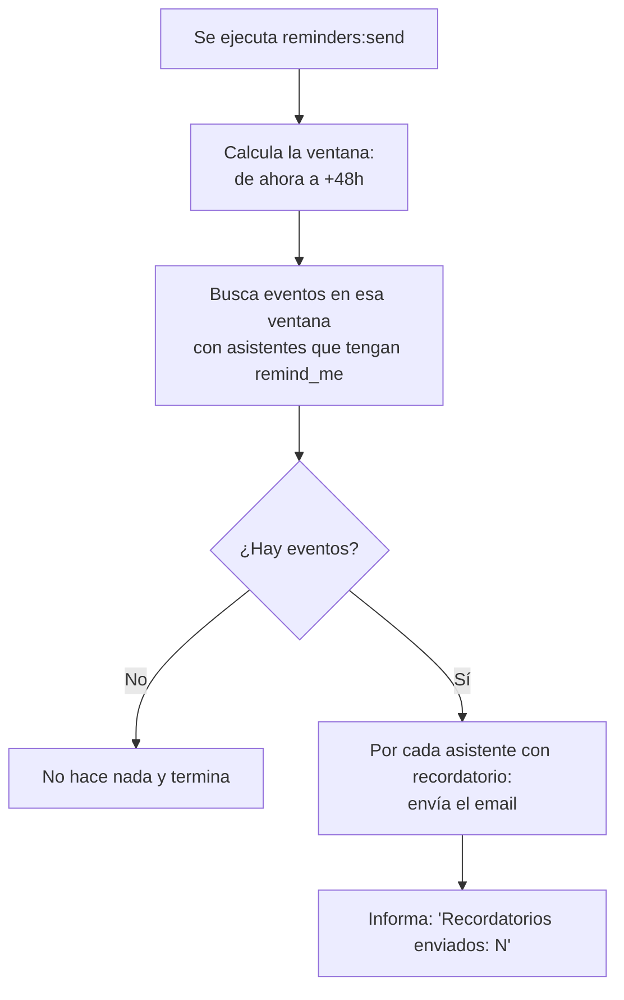
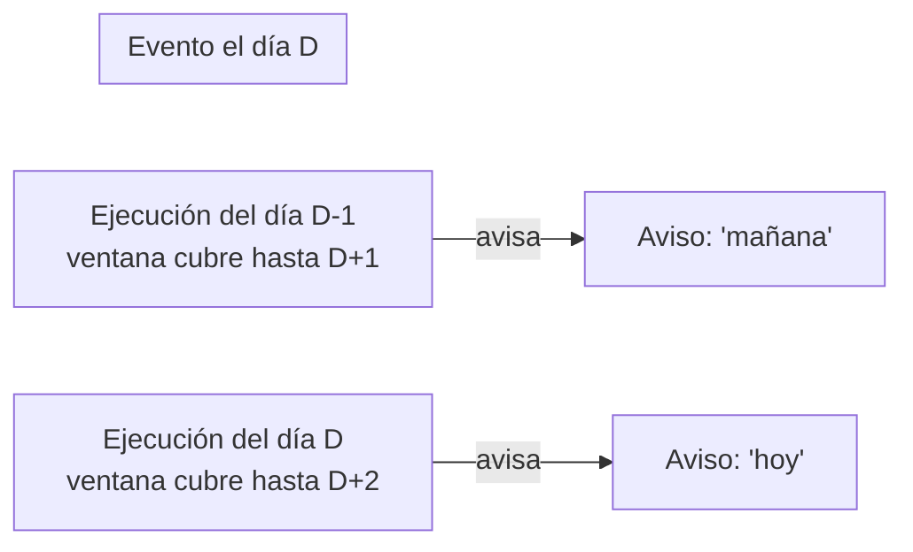
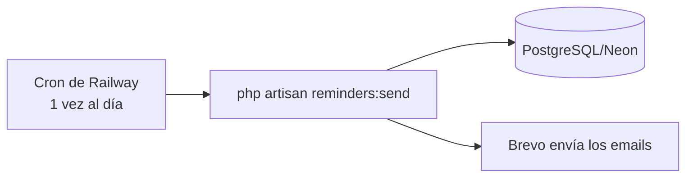

# Informe 6 — Batch / tareas programadas

> Este informe explica el **proceso automático** de la aplicación: el comando que envía los **recordatorios de eventos por email**, cómo decide a quién avisar, y cómo se ejecuta solo una vez al día (el "cron"). Es la parte que funciona "por su cuenta", sin que nadie pulse nada.

---

## 1. ¿Qué es un "batch" aquí?

Un **batch** (o tarea programada) es un trozo de código que **no se dispara por una petición del usuario**, sino que se ejecuta **automáticamente cada cierto tiempo**. En Libitum tengo uno: **`reminders:send`**, que recuerda a la gente los eventos a los que se ha apuntado.

Es un **comando de Artisan** (`app/Console/Commands/SendEventReminders.php`) que se puede lanzar a mano (`php artisan reminders:send`) o programado.

---

## 2. Qué hace, paso a paso



1. **Calcula una ventana de tiempo:** desde *ahora* hasta *dentro de 48 horas*.
2. **Busca los eventos** cuya fecha cae en esa ventana **y** que tengan al menos un asistente con el recordatorio activado (`remind_me = true` en la tabla `event_user`).
3. **Por cada asistente** con recordatorio, le **envía el email** (la plantilla de marca, ver Informe 3/5).
4. Cuenta cuántos ha enviado y lo informa.

> Eficiencia: cargo los asistentes filtrados con `with()` (eager loading) para no hacer una consulta por cada evento dentro del bucle. Eso evita el típico problema **N+1** de consultas.

---

## 3. La ventana de 48h: por qué avisa "día antes + mismo día"

Este es el detalle más fino del batch. Como el comando se ejecuta **una vez al día**, una ventana de **48 horas** hace que **cada evento entre en dos ejecuciones seguidas**:



- En la ejecución del **día anterior**, el evento está dentro de las próximas 48h → manda el aviso (*"tu evento es mañana"*).
- En la ejecución del **mismo día**, sigue dentro de la ventana → manda otro aviso (*"tu evento es hoy"*).

Así el asistente recibe **dos recordatorios**: uno con antelación para prepararse y otro el día del evento. El correo dice **"hoy" o "mañana"** según la fecha real (no "mañana" siempre).

> Si la ventana fuera de 24h, según la hora a la que corriese el cron, a veces avisaría con poco margen. Con 48h garantizamos el aviso del día antes.

---

## 4. ¿Cómo se ejecuta solo? (el cron)

Hay **dos niveles** que conviene no confundir:

### a) La definición en el código (`routes/console.php`)
```php
Schedule::command('reminders:send')->dailyAt('09:00');
```
Esto **declara** que el comando debería correr a las 9:00. Pero el programador de Laravel (`schedule:run`) necesita que **algo lo despierte cada minuto**.

### b) Lo que de verdad lo dispara en producción: el **cron de Railway**
En Railway tengo un **servicio de cron** que ejecuta directamente `php artisan reminders:send` **una vez al día** (a las 07:00 UTC ≈ 09:00 en España). Railway se encarga de "despertarlo"; no hace falta un proceso corriendo todo el rato.



> Lanzarlo a mano: también puedo ejecutarlo en cualquier momento (botón **"Run now"** en el servicio de cron de Railway, o `php artisan reminders:send` en local). Muy útil para demostrarlo en directo.

---

## 5. A dónde llegan los correos

- **En desarrollo** (`MAIL_MAILER=log`): el correo NO se envía de verdad, se escribe en `storage/logs/laravel.log`. Así pruebo sin spamear.
- **En producción** (`MAIL_MAILER=brevo`): se envía de verdad por la **API de Brevo**.

> Importante: el servicio del cron en Railway necesita las **mismas variables** que el backend (base de datos y Brevo). Si no, no encontraría ni los datos ni el correo.

---

## 6. Detalle técnico que tuve que resolver

Al construir la consulta tuve un bug: dentro de `whereHas('attendees', ...)`, el método `wherePivot('remind_me', true)` **no generaba bien el SQL** (producía una condición incorrecta). La solución fue referenciar la columna de la tabla pivote **directamente**: `where('event_user.remind_me', true)`. (Más en el Informe 9.)

---

## 7. Está probado

El batch tiene **tests automáticos** (Informe 7) que comprueban que:
- Solo avisa a los asistentes con `remind_me` activado (no a los que lo tienen apagado).
- Avisa de un evento dentro de la ventana de 48h.
- NO avisa de eventos fuera de la ventana.

---

## 8. Resumen

- Hay **un proceso automático**: `reminders:send`, que recuerda los eventos próximos por email.
- Avisa de los eventos de las **próximas 48h** → cada asistente recibe un aviso el **día antes** y otro el **mismo día**.
- Se ejecuta solo una vez al día gracias al **cron de Railway** (no a un proceso permanente).
- En producción envía por **Brevo**; en desarrollo lo escribe en el log.

> Siguiente: **Informe 7 — Tests**, donde explico la batería de pruebas automáticas que protege todo esto.
