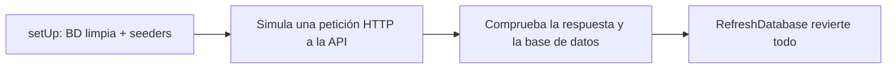

# Informe 7 — Tests

> Este informe explica las **pruebas automáticas** del proyecto: qué son, cómo funcionan, qué cubren y por qué dan confianza para cambiar el código sin romper nada. La batería tiene **44 tests** que pasan en verde.

---

## 1. ¿Qué son y por qué importan?

Un **test automático** es código que **prueba otro código**: simula una acción (por ejemplo, "un artista crea un evento") y comprueba que el resultado es el esperado. Se ejecutan todos de golpe con un comando.

¿Para qué sirven? Para **cambiar el proyecto con red de seguridad**: si toco algo y rompo otra cosa sin querer, un test falla y me avisa al instante, antes de que llegue a producción. Varios de mis tests nacieron justo de **bugs reales** que arreglé y quise "blindar" para que no volvieran (ver Informe 9).

Uso **PHPUnit** (el estándar de Laravel). Son **feature tests**: prueban la API "de fuera adentro", como lo haría un usuario real.

---

## 2. Cómo funcionan por dentro (la maquinaria)

Todos los tests comparten el mismo patrón, que conviene entender:



Las piezas clave:

| Pieza | Qué hace |
|---|---|
| **RefreshDatabase** | Envuelve cada test en una transacción que se **revierte al terminar**: la base de datos queda limpia para el siguiente. Nunca se acumulan datos. |
| **Seeders en `setUp`** | Antes de cada test se siembran roles, permisos y estados (para que existan al probar). |
| **Factories** | Generan datos falsos rápido: `User::factory()->create()`, `Event::factory()->create([...])`. |
| **`actingAs($user, 'sanctum')`** | Autentica al usuario **sin pasar por el login** (simula que ya tiene token). |
| **`Mail::fake()` / `Notification::fake()`** | Interceptan los correos: comprueban que se "enviaron" **sin enviarlos de verdad**. |

> Detalle importante: los tests corren contra **PostgreSQL** (igual que producción), no contra SQLite, porque uso consultas específicas de Postgres que en otra base no se comportarían igual.

---

## 3. Qué cubre cada bloque de tests

| Fichero (tests) | Qué comprueba |
|---|---|
| **AuthTest** (5) | Registro crea usuario **sin verificar** y sin token; login **bloqueado** si no verificado; login OK si verificado; el enlace del correo verifica la cuenta; el reenvío manda la notificación |
| **PasswordResetTest** (4) | "Olvidé mi contraseña": envía el correo, cambia la clave con token válido, **rechaza** token inválido y exige mínimo 8 caracteres |
| **Auth/PasswordUpdateTest** (2) | Cambiar contraseña estando logueado (pide la actual) |
| **EventTest** (5) | Crear evento (solo artista), espectador no puede, sin token no puede, no puedes editar el evento de otro, borrar el tuyo |
| **EventPricingTest** (2) | La **donación voluntaria** fuerza precio 0; el precio fijo se guarda |
| **InscriptionTest** (5) | Apuntarse, no dos veces (409), no si está lleno (409), y que el flag **`signed_up`** sale bien al ver el evento (logueado / invitado) |
| **RemindersTest** (3) | El **batch** solo avisa a quien tiene `remind_me`, avisa dentro de la ventana de 48h y NO fuera de ella |
| **FollowTest** (2) | Seguir y dejar de seguir a un artista |
| **FeedTest** (3) | El feed no incluye borradores, el modo "siguiendo" solo muestra a quien sigues, y requiere sesión |
| **ArtistListTest** (3) | El listado de artistas, la búsqueda **insensible a mayúsculas** y el flag `is_following` |
| **ProfileTest** (4) | Cambio de contraseña (rechaza corta / acepta válida) y validación del **Bizum** (rechaza inválido / guarda válido) |
| **AdminTest** (4) | El admin lista usuarios, cambia roles y borra eventos; un no-admin **no entra** |
| **ExampleTest** (1+1) | Tests de ejemplo de la plantilla (la app responde) |

---

## 4. Ejemplo concreto

Así se lee un test (el de "un espectador NO puede crear eventos"):

```php
$spectator = $this->makeSpectator();

$response = $this->actingAs($spectator, 'sanctum')
    ->postJson('/api/events', [ ...datos... ]);

$response->assertForbidden();                       // espera un 403
$this->assertDatabaseMissing('events', [...]);      // y que NO se guardó
```

Se lee casi como una frase: "actuando como espectador, intento crear un evento → debe devolver 403 y no guardarse".

---

## 5. Honestidad sobre la cobertura

Para que quede claro y no me pillen:
- Los 44 tests cubren el **backend (la API)**, que es donde está la lógica importante (seguridad, reglas de negocio, el batch…).
- El **frontend NO tiene tests automáticos**: se ha probado **a mano** y se apoya en **ESLint** (el linter) para detectar errores de código. Añadir tests de frontend (con Vitest/React Testing Library) es una **mejora pendiente** reconocida (Informe 12).
- No hay apenas "unit tests" puros: priorizo los **feature tests**, que prueban el comportamiento real de la API de punta a punta (más valor por test para un proyecto de este tamaño).

---

## 6. Cómo se ejecutan

```bash
php artisan test            # toda la batería
php artisan test --filter=AuthTest   # solo un fichero
```

Resultado actual: **44 passed (103 assertions)**.

---

## 7. Resumen

- **44 tests automáticos** que prueban la API de punta a punta y pasan en verde.
- Cada test parte de una **base de datos limpia** (RefreshDatabase) y usa **factories** y **fakes** de correo.
- Cubren **autenticación, seguridad, reglas de negocio, el batch y el admin**.
- Varios nacieron de **bugs reales** para que no se repitan.
- Cobertura honesta: backend sólido; frontend probado a mano (tests de frontend = mejora pendiente).

> Siguiente: **Informe 8 — Despliegue**, donde explico cómo se publica todo (Railway, Vercel, Neon, Brevo) y el proceso de puesta en producción.
