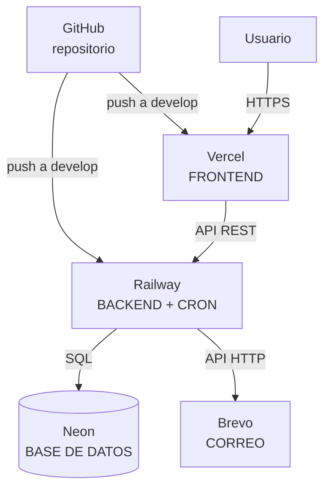
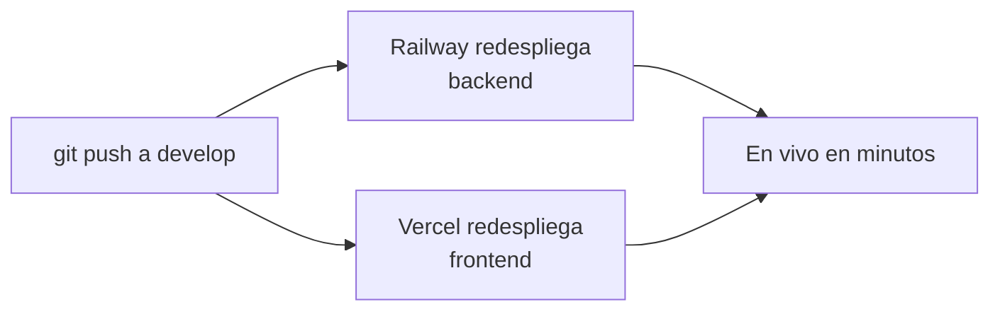

# Informe 8 — Despliegue

> Este informe explica **cómo se publica la aplicación en internet** y cómo está montada en producción: dónde vive cada parte (frontend, backend, base de datos, correo), cómo se despliega sola al hacer `git push`, y los detalles importantes (Procfile, regiones, variables, persistencia de imágenes).

---

## 1. La arquitectura del despliegue

Libitum está repartida en **cuatro servicios**, cada uno en su sitio:



| Parte | Dónde | Por qué |
|---|---|---|
| **Frontend** (React) | **Vercel** | CDN global, despliegue automático, ideal para SPAs estáticas |
| **Backend** (Laravel) | **Railway** | Despliega apps + base de datos fácil, con cron |
| **Base de datos** (PostgreSQL) | **Neon** | Postgres gestionado con capa gratis |
| **Correo** | **Brevo** | Envío por API (no SMTP) |

Todo va por **HTTPS** (lo dan Vercel y Railway), que además es **requisito** para la PWA y las URLs firmadas.

---

## 2. Backend en Railway

El repositorio tiene `backend/` y `frontend/` juntos (monorepo), así que en Railway configuro **Root Directory = `backend`** para que solo construya esa parte. Railway detecta que es PHP/Laravel (con **Nixpacks**) e instala las dependencias de Composer.

### El `Procfile` (qué se ejecuta al arrancar)
```
web: php artisan migrate --force
   && php artisan db:seed --class=ProductionSeeder --force
   && php artisan config:cache && php artisan event:cache && php artisan view:cache
   && php artisan storage:link --force
   && php artisan serve --host=0.0.0.0 --port=${PORT:-8000}
```

Paso a paso:
1. **`migrate --force`**: aplica las migraciones (crea/actualiza las tablas) en cada despliegue.
2. **`db:seed ProductionSeeder`**: siembra lo imprescindible (estados, roles, categorías, admin). Es idempotente: no duplica.
3. **`config:cache`, `event:cache`, `view:cache`**: cachean la configuración para que cada petición arranque **más rápido**.
4. **`storage:link`**: crea el enlace para servir las imágenes subidas.
5. **`serve`**: arranca el servidor en el puerto que indica Railway.

### Detalles de producción
- **Región: Europa (Ámsterdam)**, para estar cerca de la base de datos (Neon en Frankfurt) y de los usuarios → menos latencia.
- **Volumen persistente**: como el disco de Railway es "efímero" (se borra en cada despliegue), monté un **volumen** en `storage/app/public` para que las **imágenes subidas no se pierdan**.

> Nota honesta: uso `php artisan serve`, que es un servidor de **desarrollo** (atiende de una en una). Para el piloto y la presentación va bien; para tráfico alto habría que cambiarlo por un servidor de producción (php-fpm/Octane). Ver Informe 12.

---

## 3. El servicio del cron (recordatorios)

Para el batch (Informe 6) tengo un **segundo servicio** en Railway, del mismo repo y Root Directory `backend`, pero con:
- **Comando de arranque:** `php artisan reminders:send`
- **Cron Schedule:** una vez al día (07:00 UTC ≈ 09:00 España)
- Botón **"Run now"** para lanzarlo a mano (útil para la demo).

Necesita las **mismas variables** que el backend (base de datos y correo).

---

## 4. Frontend en Vercel

- **Root Directory = `frontend`** (igual que en Railway, por el monorepo). Vercel detecta **Vite** y hace `npm run build` → genera `dist/`.
- **`vercel.json`** con una regla de **rewrite**: cualquier ruta (`/event/5`, `/artistas`…) sirve el `index.html`. Esto es necesario en una **SPA**: el enrutado lo lleva React en el cliente, así que todas las URLs deben cargar la misma página base.
- **Variable de entorno:** `VITE_API_URL` apunta al backend de Railway (así el frontend sabe a dónde llamar).

---

## 5. Base de datos (Neon) y correo (Brevo)

- **Neon**: PostgreSQL gestionado. Le doy al backend la cadena de conexión por la variable `DB_URL`. Está en la región de **Frankfurt** (Europa).
- **Brevo**: el backend manda los correos por su **API** con una clave (`BREVO_KEY`) y un remitente verificado.

---

## 6. Despliegue continuo: "push y listo"

No despliego a mano: está conectado a GitHub.



Cada vez que subo cambios a la rama `develop`, **Railway y Vercel se actualizan solos** en un par de minutos. Si algo falla en el build, lo veo en sus paneles (logs).

---

## 7. Variables de entorno en producción (resumen)

| Servicio | Variables clave |
|---|---|
| **Railway (backend + cron)** | `APP_KEY`, `APP_ENV=production`, `APP_DEBUG=false`, `APP_URL`, `APP_TIMEZONE`, `FRONTEND_URL`, `DB_CONNECTION=pgsql`, `DB_URL`, `MAIL_MAILER=brevo`, `BREVO_KEY`, `MAIL_FROM_*`, `ADMIN_*` |
| **Vercel (frontend)** | `VITE_API_URL` |

> Los secretos solo viven en estos paneles, **nunca en el código**.

---

## 8. Resumen

- **4 servicios**: frontend (Vercel), backend + cron (Railway), base de datos (Neon), correo (Brevo), todos por HTTPS.
- El backend usa **Nixpacks + Procfile** (migra, siembra, cachea y arranca) con **región EU** y **volumen** para que las imágenes persistan.
- El frontend es estático en Vercel con **rewrites de SPA**.
- **Despliegue continuo**: `git push` → todo se actualiza solo.
- Limitación conocida: el servidor del backend (`artisan serve`) es de desarrollo; escalar es una mejora pendiente (Informe 12).

> Siguiente: **Informe 9 — Problemas encontrados y soluciones**, donde cuento los bugs y decisiones técnicas más interesantes del proyecto.
