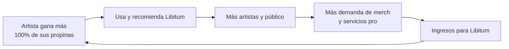

# Informe 13 — Monetización (enfoque empresarial)

> Este informe explica **cómo podría ganar dinero Libitum** y, sobre todo, la **filosofía de negocio** detrás: monetizar **sin perjudicar al artista**. No es un plan de empresa cerrado, sino el modelo y las vías que tienen sentido para este proyecto.

---

## 1. La filosofía: no quitarle dinero al artista

La decisión de negocio más importante es **deliberada**: Libitum **NO procesa las donaciones** ni se queda comisión de ellas. Cuando alguien apoya a un artista, el dinero va **directo** del donante al artista por su plataforma (PayPal, Ko-fi, Bizum…). Libitum solo conecta y muestra.

¿Por qué?
- **Por el artista:** el artista de calle vive de poco; quitarle una comisión de cada propina sería injusto y le echaría para atrás.
- **Por simplicidad legal:** ser pasarela de pago implica obligaciones legales y técnicas enormes (licencias, antifraude, fiscalidad). Evitarlo mantiene el proyecto viable.

**Consecuencia:** como las donaciones no son una vía de ingreso, la monetización tiene que venir de **otros sitios** que aporten valor sin restar al artista.

---

## 2. Vías de monetización actuales (implementadas)

### 2.1. Merchandising del QR
- **Qué:** fabricar material físico con el **QR del artista** (pegatinas, láminas, carteles, chapas) para que la gente lo encuentre y lo siga en la calle.
- **Por qué funciona:** le da al artista algo **tangible y útil** (su QR en la funda de la guitarra, en el local…), y a Libitum un ingreso por la venta/fabricación.
- **Cómo está montado:** una sección de merchandising en la página de Contacto, donde el artista lo solicita por correo.

### 2.2. Apoyo a los desarrolladores
- **Qué:** un botón discreto **"✨ Apoya el proyecto"** con un enlace de donación (PayPal) para quien quiera ayudar a mantener la web.
- **Por qué:** cubre los **costes de mantenimiento** (los ~5 €/mes del hosting) de forma voluntaria, sin meter publicidad ni comisiones.

---

## 3. Vías de monetización futuras (ideas de negocio)

Pensando a futuro, sin romper la filosofía de no cobrar al artista por sus propinas:

| Vía | En qué consiste |
|---|---|
| **Freemium para artistas** | Cuenta gratis con lo esencial; cuenta "pro" de pago con extras: estadísticas avanzadas, página personalizada, más eventos destacados… |
| **Eventos destacados** | El artista puede pagar (poco) por **destacar** un evento concreto en el feed/búsqueda durante unos días |
| **Comisión del merchandising** | El margen de la venta del material físico (no de las propinas) |
| **Acuerdos con locales** | Bares, salas y festivales que paguen por aparecer o por promocionar sus eventos |
| **Patrocinios locales** | Marcas que apoyen la cultura de calle a cambio de visibilidad discreta |

> El hilo común: el artista **siempre puede usar lo esencial gratis** y quedarse el 100% de sus donaciones; se cobra por **servicios de valor añadido** (merch, destacar, herramientas pro), no por su dinero.

---

## 4. Por qué este modelo tiene sentido

Es un modelo **alineado**: Libitum gana **cuando el artista gana**. Si el artista prospera, usa más la plataforma, atrae público, y eso genera demanda de los servicios de pago (merch, pro). No es un modelo extractivo (quitarle al artista), sino de **crecer juntos**.

---

## 5. Costes vs ingresos (realista)

- **Costes actuales:** mínimos (~5 €/mes de hosting). El proyecto es **sostenible desde el primer momento** con muy poco.
- **Primeros ingresos realistas:** el **merchandising** es la vía más inmediata y concreta para empezar a generar algo, sin necesidad de mucha escala.
- **Escalabilidad del negocio:** las vías de pago (freemium, destacados) solo tienen sentido **con masa de usuarios**; son para más adelante, cuando haya comunidad.

---

## 6. Resumen

- Decisión clave: **no cobrar comisión de las donaciones** (el artista se queda el 100%) → ni perjudica al artista ni nos convierte en pasarela de pago.
- Monetización por **valor añadido**: **merchandising** del QR (ya montado) y **apoyo voluntario** a los devs.
- A futuro: **freemium**, **eventos destacados**, **comisión de merch** y **acuerdos con locales/patrocinios**.
- Modelo **alineado**: Libitum gana cuando el artista gana.

> Siguiente: **Informe 14 — Impacto en los artistas y planteamiento de pagos**, el cierre, donde explico el porqué humano del proyecto y todas las decisiones sobre los pagos.
